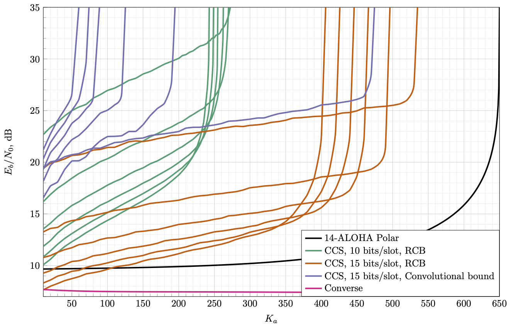
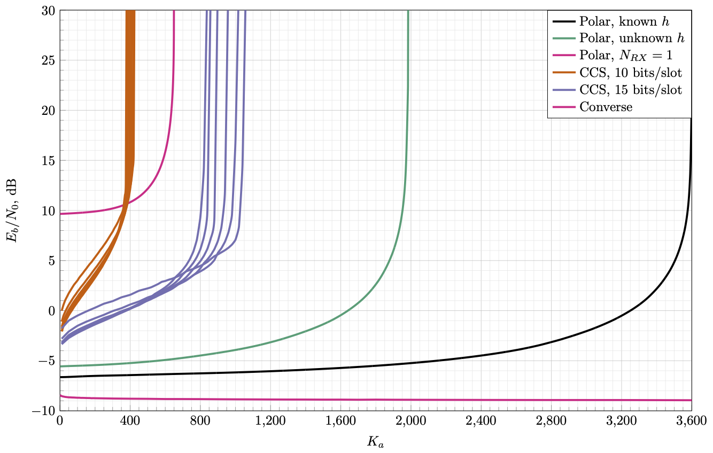
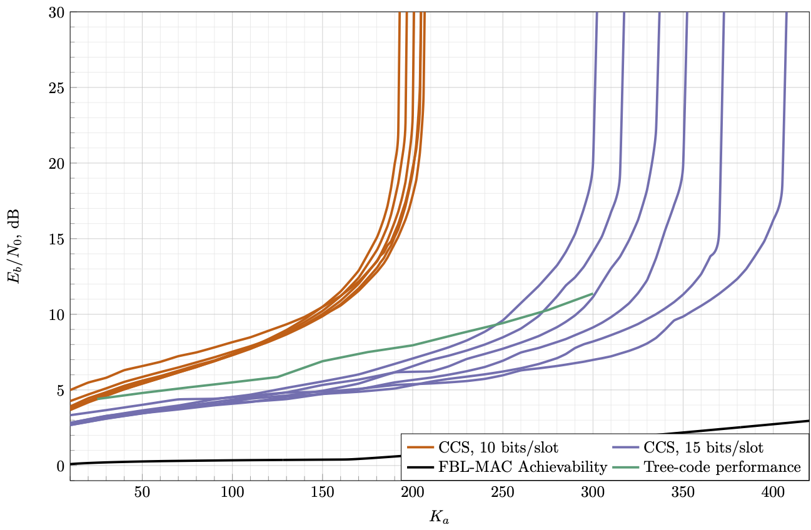

# Simulation results
## Fading channel

For the fading channel, we assume the maximum tolerable missed detection probability as 0.1, and maximum false alarm rate as 0.001
 
 
## AWGN channel
For the AWGN channel, we assume the maximum tolerable missed detection probability as 0.05, and maximum false alarm rate as 0.05
 
